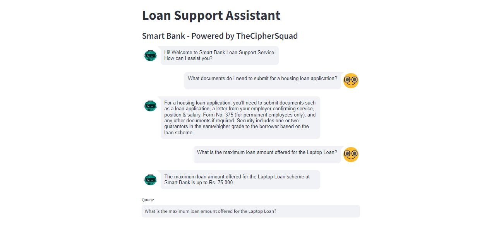

# IntelliHack24 - Task3 (LLM Based Loan Support Assistant)

This repository contains the Task3 - LLM Chatbot developed as a partial requirement for completing Initial Round of IntelliHack 2024.

The Smart Bank Loan Assistant Chatbot is an AI-powered tool designed to assist users with inquiries related to loan products offered by SmartBank.

#### Product Overview



### Installation Guidelines

Before starting the project, you can create a seperate python environment and activate it, so that we can install all the required dependencies within the environment.

#### 1. Create a Seperate Environment

```bash
  python -m venv env
```

#### 2. Activate Environment

```bash
  env/Scripts/activate
```

#### 3. Install Required Dependencies

```bash
  pip install -r requirements.txt
```

#### 4. Configure API Keys in .env

Create a .env file in the root directory, and update the API Keys

```bash
LANGCHAIN_API_KEY = "XXXXXX"
LANGCHAIN_PROJECT = "IntelliHack24"
OPENAI_API_KEY = "XXXXXX"
```

#### 5. Run the Project

```bash
streamlit run app.py
```
